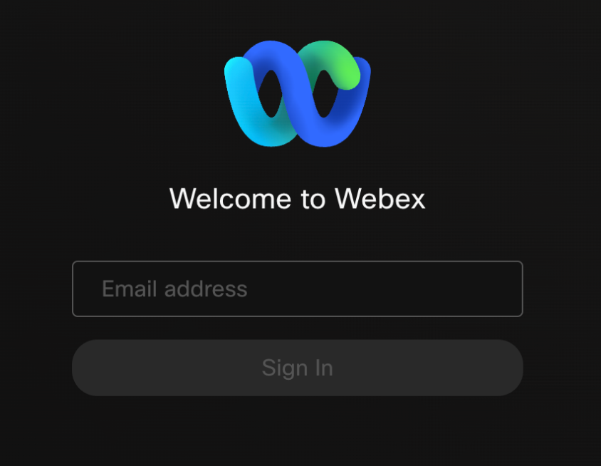
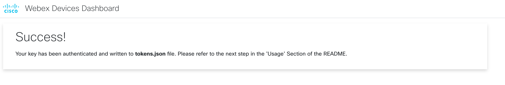
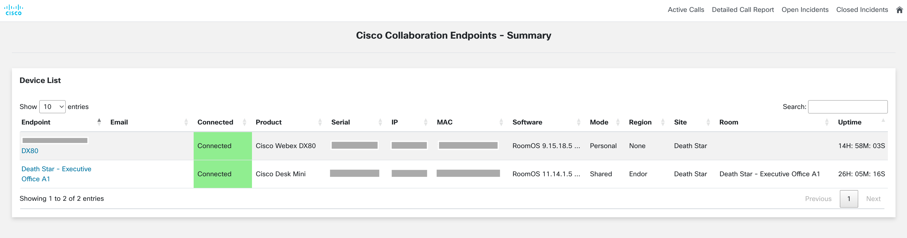
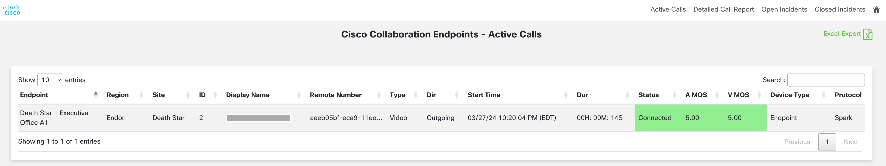
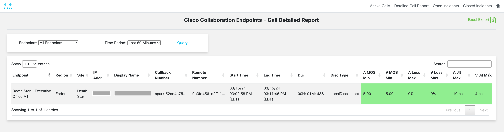
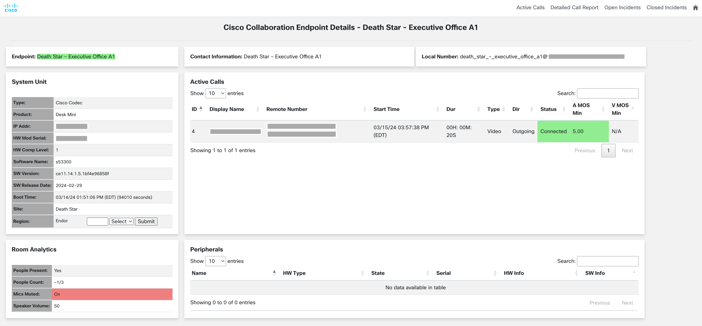
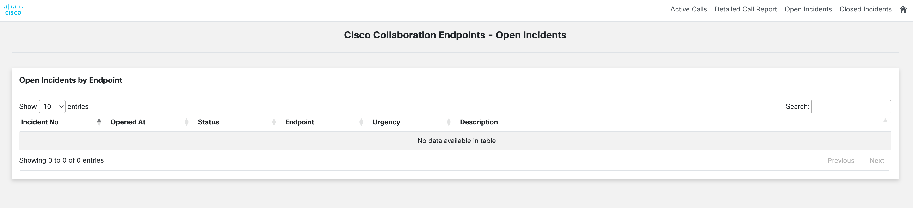
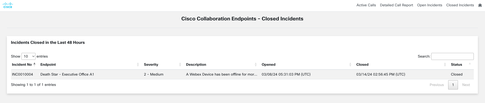

# Webex Devices and Device Calling Dashboard

This dashboard displays summary information about Webex Devices across a Webex Org and both Active and Historic (CDR) **Device** Call information.
The focus of this dashboard is to monitor `Webex Devices` and `Webex Device Calls` both in realtime and historically to identify problems impacting calls.

The dashboard can also integrate with ServiceNow to display Open and Closed Tickets related to Webex Devices.

Summary information about Webex Devices includes:
* Endpoint Name
* Serial, MAC, IP
* Software
* Site, Room Information
* Uptime, Status
* Room Analytics, Peripherals
* etc.

Device Call Information includes:
* Active Calls (Name, Remote Number, Start Time, Duration, Status, etc.)
* Historic Calls (Name, Remote Number, Start/End Time, Duration, etc.)
* Audio and Video **MOS Values** for Call Quality (see `MOS Values` section for more details)
* etc.

**Note**: 
* The dashboard makes heavy use of the **xAPI** (executed through Webex) to access active and historic calls, device information, etc. Devices **MUST** have the xAPI enabled and the correct permissions set.
* 60 days worth of historic call information per device is retained by default, and call history is refreshed every 10 minutes (both configurable in `config.py`)

## Contacts
* Trevor Maco

## Solution Components
* Webex Devices
* xAPI
* ServiceNow

## Prerequisites
### Webex OAuth Integration

**OAuth Integrations** are how you request permission to invoke the Webex REST API on behalf of another Webex Teams user. To do this in a secure way, the API supports the OAuth2 standard which allows third-party integrations to get a temporary access token for authenticating API calls instead of asking users for their password. 

**Note**: It's important to use a `Full Admin Account` as the underlying account for the integration. Several API calls within the script are 'admin-only'.

To register an integration with Webex Teams:
1. Log in to `developer.webex.com`
2. Click on your avatar at the top of the page and then select `My Webex Apps`
3. Click `Create a New App`
4. Click `Create an Integration` to start the wizard
5. Follow the instructions of the wizard and provide your integration's name, description, and logo
6. Add the Following Redirect URI: `http://0.0.0.0:5500/callback` (**this must be exact**)
7. Add The following scopes to the application:
   * `spark:xapi_statuses`
   * `spark:xapi_commands`
   * `spark-admin:devices_read`
   * `spark-admin:workspaces_read`
   * `spark-admin:locations_read`
8. After successful registration, you'll be taken to a different screen containing your integration's newly created Client ID and Client Secret
9. Copy the secret and store it safely. Please note that the Client Secret will only be shown once for security purposes

> To read more about Webex Integrations & Authorization and to find information about the different scopes, you can find information [here](https://developer.webex.com/docs/integrations)

### Docker
This app provides a `Docker` file for easy deployment. `Docker` is the recommended deployment method. Install `Docker` [here](https://docs.docker.com/get-docker/).

### ServiceNow
If integrating with ServiceNow, gather the `url` and `username`/`password` for a ServiceNow Admin associated with the target ServiceNow instance. A free developer instance can be created with the [Developer Program](https://developer.servicenow.com/)

While there's many ways a ServiceNow incident table and tickets can be organized, it's recommended to set the `Short Description` of a Webex Device Ticket to that of the `Endpoint Name` and group device tickets in some way (category, etc.). This allows the dashboard to easily retrieve relevant incidents (based on ServiceNow filtering query) and display the Endpoint Name associated with the ticket.


## MOS Value Calculations
This dashboard utilizes Audio and Video MOS scores to indicate the performance and user experience in Active and Historic Calls. These MOS scores are based on **Packet Loss** and **Jitter**.

To calculate the MOS values, we use the following methodology:
1. Start with a Base Score of 5.0 (perfect)
2. Jitter (last 5 seconds): Jitter above 10 ms receives incremental penalties of 0.1 for every 10 ms of jitter
3. Packet Loss (last 5 seconds): Packet loss up to 2% incurs no penalty, between 2-5% incurs a penalty of 0.5, and above 5% incurs a 1.5 penalty
4. Final score calculations: This method is applied to Audio and Video **Incoming** and **Outgoing** streams, and we take the minimum MOS score as our final score for Audio and Video respectively

This methodology, penalties, and threshold can be modified in `flask_app/util.py` > `calculate_mos` if desired.

## Installation/Configuration
1. Clone this repository with `git clone [repository name]`. To find the repository name, click the green `Code` button above the repository files. Then, the dropdown menu will show the https domain name. Click the copy button to the right of the domain name to get the value to replace [repository name] placeholder.
2. Rename the `.env_sample` file to `.env`. Rename `config_sample.py` to `config.py` (in `flask_app` directory).
3. Add the `Webex Client Key` and `Client Secret` to `.env` from the prerequisites section.
```dotenv
WEBEX_CLIENT_ID=""
WEBEX_CLIENT_SECRET=""
```
4. (optional) Configure `Device Type` filter to only consider specific types of devices in `config.py`, and modify `Maximum Call History` retained per device and/or `Call History Refresh Frequency` if desired.
```python
# (optional) Filter devices by type (roomdesk, phone, accessory, webexgo, unknown)
DEVICE_TYPE = ""

# Max Period (in days) to keep call history, Frequency to gather call history from devices (minutes)
CALL_HISTORY_MAX_PERIOD = 60
CALL_HISTORY_REFRESH_CYCLE = 10
```
5. If integrating ServiceNow capabilities (Default = False) (`config.py`), add ServiceNow instance variables (`.env`) obtained from the prerequisites section.
```python
# config.py
SERVICE_NOW_FEATURE = True
```
```dotenv
# .env
SERVICENOW_INSTANCE="<replace>"
SERVICENOW_USERNAME="<replace>"
SERVICENOW_PASSWORD="<replace>"
```
6. If following the design of setting the `Short Description` of a ServiceNow ticket to that of the corresponding `Device Name`, set `INCLUDE_ENDPOINT_NAME` to True (this will display the endpoint name associated with a Ticket on the dashboard).
```python
INCLUDE_ENDPOINT_NAME = True
```
7. Modify the ServiceNow Queries used to retrieve `Open/Closed Tickets` associated with Webex Devices based on Incident Table structure (ex: Tickets with a 'devices' category). The queries mimic the dashboard queries and are highly dependent on how device tickets are classified and organized.
```python
# ServiceNow Filters (controls which incidents are returned to the dashboard - by default: active tickets (open),
# last 48 hours (closed) For all available filter parameters, build filter with UI, right click query string,
# copy query to sysparm_query
OPEN_SERVICE_NOW_INCIDENT_FILTER = {"sysparm_display_value": "true", "sysparm_query": "active=true^category=devices"}

LAST_X_HOURS = 48 # Last 48 hours of closed tickets by default
CLOSED_SERVICE_NOW_INCIDENT_FILTER = {"sysparm_display_value": "true", "sysparm_query": "active=false^category=devices"}
```
8. Set up a Python virtual environment. Make sure Python 3 is installed in your environment, and if not, you may download Python [here](https://www.python.org/downloads/). Once Python 3 is installed in your environment, you can activate the virtual environment with the instructions found [here](https://docs.python.org/3/tutorial/venv.html).
9. Install the requirements with `pip3 install -r requirements.txt`

## Usage
* `Webex OAuth Token`: Before launching the dashboard, generate a `Webex OAuth Token` with script `flask_app/webex_tokens.py` (This web app script **must be run first**):
``` bash
$ python3 flask_app/webex_tokens.py
```

Once the script is running, navigate to `http://0.0.0.0:5500` (the same one configured in the Webex Integration). This will prompt a Webex Login page.



Sign in with the `Full Admin Account`. The account provided here grants the access permissions of the account to the token (in addition to the scopes defined in the integration).

You may be prompted to grant access to the integration. Once successful, a landing page with a 'Success' message is displayed:



An 'Access Token' and a 'Refresh Token' will be written to `tokens.json`. The 'Access Token' and 'Refresh Token' are valid for **14** and **90** days respectively. If the access token expires, it will automatically be refreshed if the refresh token is valid (and the refresh token's life is reset back to 90 days).

The process only needs to be completed **once** if the dashboard is launched within 90 days of generating the tokens. Otherwise, if both tokens are expired, the process must be repeated.

* `Launching the Dashboard`: To launch the dashboard, use the following commands to run with python directly:
```
$ python3 flask_app/db.py
$ python3 flask_app/app.py
```
or with the docker command:
```
$ docker-compose up -d --build
```

**Note**:
* `db.py` creates a sqlite database which maintains the historic call information (**it must be run first!**) while `app.py` represents the main flask app.
* App logs and output are written to stdout console and log files in `flask_app/logs`

Once the app is running, navigate to http://127.0.0.1:5000 to be greeted with the main landing page (overview page):



This page summarizes Webex Devices seen in the organization (Note: if a device isn't present, the device likely doesn't have xAPI permission - see logs)

The remaining pages and workflows are summarized below:

`Active Calls`:



Show current active calls and their MOS values.

`Historic Calls`:



See historic calls for all or a specific device based on the selected time period (up to 60 days).

`Device Details`:



Clicking into a device on the landing page displays further details about a Webex Device, including peripherals, room analytics, system unit informaiton, etc.

`Open Tickets`:



If integrated with ServiceNow, this page displays any open tickets (based on query) for Webex Devices.

`Closed Tickets`:



If integrated with ServiceNow, this page displays closed tickets (based on query) for Webex Devices in the last 48 hours (by default). If INCLUDE_ENDPOINT_NAME is set to True, you will see an Endpoint Name otherwise that column will be blank.


### LICENSE

Provided under Cisco Sample Code License, for details see [LICENSE](LICENSE.md)

### CODE_OF_CONDUCT

Our code of conduct is available [here](CODE_OF_CONDUCT.md)

### CONTRIBUTING

See our contributing guidelines [here](CONTRIBUTING.md)

#### DISCLAIMER:
<b>Please note:</b> This script is meant for demo purposes only. All tools/ scripts in this repo are released for use "AS IS" without any warranties of any kind, including, but not limited to their installation, use, or performance. Any use of these scripts and tools is at your own risk. There is no guarantee that they have been through thorough testing in a comparable environment and we are not responsible for any damage or data loss incurred with their use.
You are responsible for reviewing and testing any scripts you run thoroughly before use in any non-testing environment.